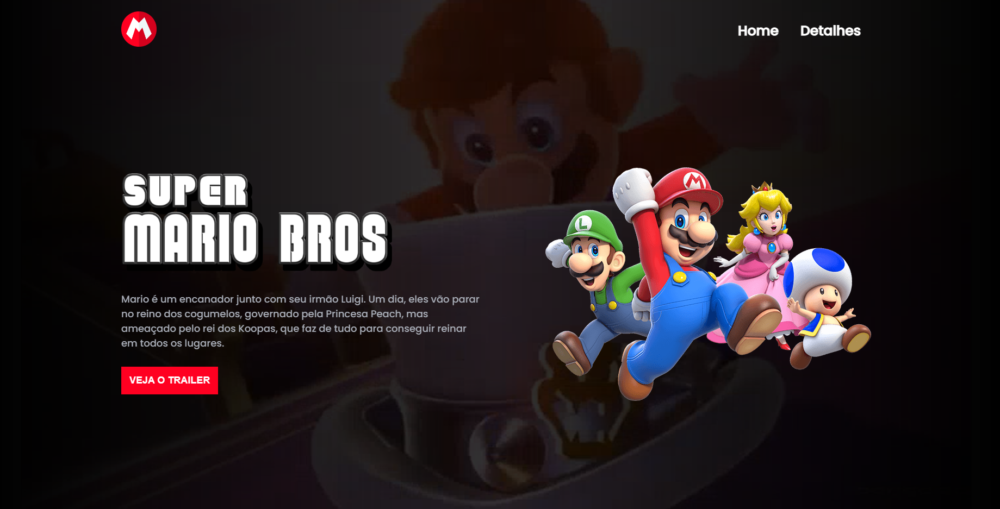

<h1 align="center">Projeto Super Mario - O Filme</h1>

Projeto desenvolvido através das aulas do programa "Semana do Zero ao Programador Contratado" do canal [Dev em Dobro](https://www.youtube.com/channel/UCGXiaSPSmORM_4_b05kfMlg).

## Sobre

Este projeto foi desenvolvido utilizando HTML5, CSS e JavaScript. 

Abaixo você pode ver como ficou o resultado final e pode acessar ao vivo [clicando aqui](https://karinamsakata.github.io/projeto-super-mario/).

. 
